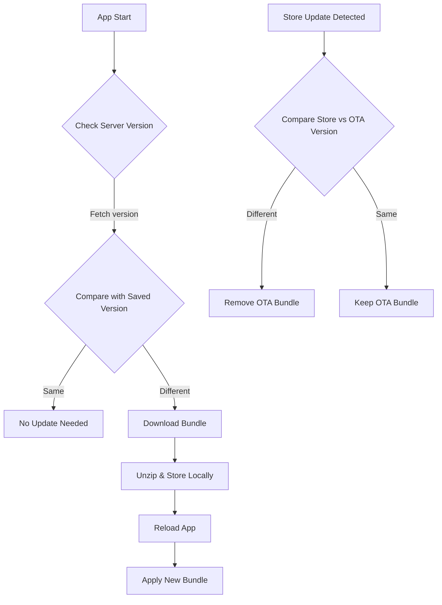

# 📦 React Native OTA

A lightweight React Native TurboModule library for Over-The-Air (OTA) updates, allowing seamless JavaScript bundle updates without requiring a full app store release.

## ✨ Features

- **Download** new JS bundles from your server (HTTP/HTTPS).
- **Unzip and Store** bundles locally on the device.
- **Reload** the app to apply the new bundle instantly.
- **Automatic Cleanup** of OTA bundles when the app is updated via App Store or Google Play.

## 🚀 Installation

Install the library using your preferred package manager:

```bash
yarn add react-native-ota
# or
npm install react-native-ota
```
IOS
```
cd ios && pod install
```

## 🛠️ Config

IOS: in Appdelegate.swift

```Appdelegate.swift
import Ota
...

class ReactNativeDelegate: RCTDefaultReactNativeFactoryDelegate {
  override func sourceURL(for bridge: RCTBridge) -> URL? {
    self.bundleURL()
  }

  override func bundleURL() -> URL? {
#if DEBUG
    RCTBundleURLProvider.sharedSettings().jsBundleURL(forBundleRoot: "index")
#else
    return OtaHelper.bundleURL() // <--add this
#endif
  }
}
```
Android: In MainApplication.kt 

```MainApplication.kt
//import this
import java.io.File
import com.ota.OtaHelper
...
... 

//config
 override fun getJSBundleFile(): String? {
        val otaFile: File? = OtaHelper.getBundleFile(applicationContext)
        return otaFile?.absolutePath ?: super.getJSBundleFile()
      }
```


## 📦 Script build bundle

Add 2 scripts for build bundle file .zip in package.json

```package.json
 "scripts": {
   ...

    "bundle:ios": "npx react-native bundle --entry-file index.js --platform ios --dev false --bundle-output ios/main.jsbundle --assets-dest ios && cd ios && zip -r main.jsbundle.zip main.jsbundle",
    "bundle:android": "npx react-native bundle --entry-file index.js --platform android --dev false --bundle-output android/app/src/main/assets/index.android.bundle --assets-dest android/app/src/main/res && cd android/app/src/main/assets && zip -r index.android.bundle.zip index.android.bundle"
  }
```

## ⚡ Server
This repo is a basic local backend example for the library

```
https://github.com/DucNhatNguyen23/ota-server-example
```

## 📖 Usage

Below is an example of how to implement OTA updates in your React Native app:

```javascript
import {
  downloadBundle,
  getSavedVersion,
  reloadApp,
  // removeBundle,
} from 'react-native-ota';
import { Platform } from 'react-native';

const URL = 'https://your-url';
const handleDownload = async () => {
  try {
    // Fetch version code from your server
    // Expected response format: { versionCode: number }
    const response = await fetch(`${URL}/ota/version`);
    const getVersion = await response.json();

    // Get the locally saved version code
    const savedVersion = getSavedVersion();

    // Check if the app is already on the latest version
    if (savedVersion === getVersion.versionCode) {
      console.log('Already on the latest version');
      return;
    }

    // Select platform-specific bundle URL
    // URL response bundle from server (main.jsbundle.zip for ios, index.android.bundle.zip for android)
    const url = Platform.select({
      android: `${URL}/ota/android-bundle`,
      ios: `${URL}/ota/ios-bundle`,
    });

    // Download and save the bundle and save version code form server in storage app
    const result = await downloadBundle(url, getVersion.versionCode);

    // If download is successful, reload the app to apply the new bundle
    if (result.status) {
      reloadApp();
    }
  } catch (e) {
    console.error('OTA update failed:', e);
  }
};
```

## 🔍 API Reference

| Method                                                                           | Description                                                                                 |
| -------------------------------------------------------------------------------- | ------------------------------------------------------------------------------------------- |
| `downloadBundle(url: string, versionCode: number): Promise<{ status: boolean }>` | Downloads a bundle from the specified URL and saves it locally with the given version code. |
| `reloadApp(): Promise<string>`                                                   | Reloads the app to apply the new bundle.                                                    |
| `getSavedVersion(): number`                                                      | Retrieves the version code of the currently saved OTA bundle.                               |
| `removeBundle(): Promise<void>`                                                  | Removes the OTA bundle from local storage.                                                  |

## ⚠️ Important Notes

- **OTA vs. Store Updates**: OTA updates are for JavaScript bundle changes only. Native code changes still require official App Store or Google Play updates.
- **Version Conflict Handling**:
  - When the app is updated via App Store or Google Play, the library compares the store app version with the local OTA bundle version.
  - If versions differ, the old OTA bundle is automatically removed to prevent conflicts.
- **Best Practices**: Always test OTA updates thoroughly to ensure compatibility with your app’s native codebase.

## 📹 Demo

_(Insert a GIF or video here to showcase OTA updates in action. For example, demonstrate downloading a bundle and reloading the app.)_

## 🔄 OTA Update Workflow

The following diagram illustrates the OTA update process:



## 📝 License

This project is licensed under the MIT License.

## 🙌 Contributing

Contributions are welcome! Please open an issue or submit a pull request on [GitHub](https://github.com/DucNhatNguyen23/react-native-ota).
